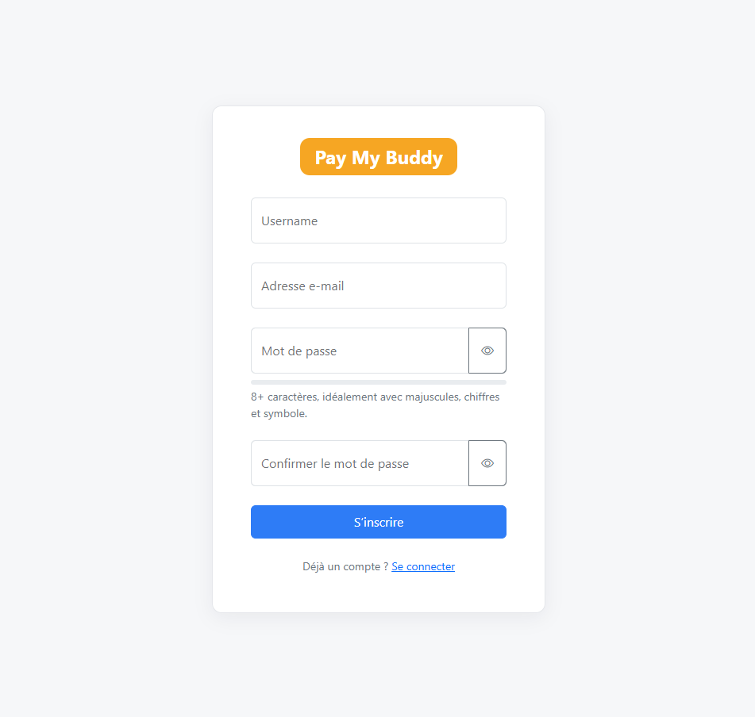

# Pay My Buddy

Application web pour transférer de l’argent entre proches, recharger un portefeuille virtuel et retirer vers un compte bancaire.

## Fonctionnalités

- Inscription avec adresse e-mail unique ou connexion via Facebook  
- Authentification sécurisée (Spring Security + BCrypt)  
- Ajout d’amis via leur adresse e-mail  
- Transfert d’argent entre utilisateurs enregistrés  
- Rechargement du solde (dépôt)  
- Retrait vers un compte bancaire
- Prélèvement automatique de 0,5 % sur chaque transaction
- Historique des transactions : soldes mis à jour en temps réel
- Profil utilisateur : username, email, IBAN, BIC, mot de passe

## Stack technique

- Langage : Java 24
- Framework : Spring Boot 3.5.5
- Build : Maven
- Front : Thymeleaf + Bootstrap 5
- Sécurité : Spring Security + OAuth2
- Base de données : MySQL 8
- ORM : Spring Data JPA / Hibernate
- Tests : JUnit 5, Spring Security Test, JaCoCo, Surefire

## Architecture (MVC)
```
com.openclassrooms.payMyBuddy
 ├─ controller/          # AuthController, LoginController, DashboardController, ProfileController, WalletController
 ├─ dto/                 # RegisterDTO, TransferDTO, DepositDTO, WithdrawDTO, FriendDTO, ProfileDTO
 ├─ model/               # User, Transaction, TransactionType
 ├─ repository/          # UserRepository, TransactionRepository
 ├─ security/            # SpringSecurityConfig
 ├─ service/             # UserService, WalletService, TransactionService, CurrentUserService, CustomUserDetailsService
 └─ resources/templates  # login, register, dashboard, profile, connections (+ fragments)
```

## Modèle physique de données


## Comptes de test

1) email : laure@gmail.com
   mot de passe : Wxcvbn?123
   rôle : utilisateur
2) email : clara@gmail.com
   mot de passe : 456
   rôle : utilisateur
3) email : luc@gmail.com
   mot de passe : 789
   rôle : utilisateur
4) email : bank@gmail.com
   mot de passe : (bloqué)
   rôle : compte système (banque virtuelle)
> Le compte **Bank** représente le système externe et ne peut se connecter.

## Fonctionnement des transactions

- **Dépôt** : crédite le solde de l’utilisateur avec 0,5 % de frais  
- **Transfert P2P** : l’expéditeur paie 0,5 % de frais, le destinataire reçoit la totalité  
- **Retrait** : débite le solde avec 0,5 % de frais  
- **Bank (is_bank=1)** : sert d’intermédiaire virtuel pour les opérations hors application

## Endpoints

- `GET /login` – page de connexion  
- `GET /register` / `POST /register` – inscription  
- `GET /transfer` / `POST /transfer` – page principale pour rechargement, transfert, retrait  
- `GET /connections` / `POST /connections` – gestion des relations (ajout par email)  
- `GET /profile` / `POST /profile` – consultation & mise à jour du profil
- `POST /logout` – déconnexion

## Captures d'écran de l'application





## Tests et couverture

- Rapport de couverture JaCoCo : `target/site/jacoco/index.html`
- Rapport de couverture Surefire : `target/reports/surefire.html`